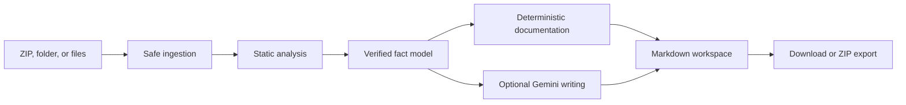

<div align="center">
  

  <h1>ResourceDocs</h1>

  <p><strong>Source-backed documentation generation for FiveM and RedM resources.</strong></p>
  <p>
    Upload a resource, inspect what can be verified, and export polished documentation<br />
    for installation, configuration, exports, events, commands, and dependencies.
  </p>

  <p>
    <a href="https://res.hastherish.com"><strong>Live application</strong></a>
    ·
    <a href="#quick-start">Quick start</a>
    ·
    <a href="#how-it-works">How it works</a>
    ·
    <a href="#security-and-privacy">Security</a>
    ·
    <a href="#contributing">Contributing</a>
  </p>

  <p>
    
    
    
    
    
  </p>
</div>

---

ResourceDocs turns readable FiveM and RedM resource files into structured developer documentation. It combines deterministic static analysis with optional Gemini-assisted writing: source code establishes the facts, while AI improves the explanation around those facts.

The generator is designed for real resource packages, including partially protected Asset Escrow releases. It documents what can be verified, reports what could not be inspected, and never attempts to execute, decrypt, or deobfuscate uploaded scripts.

> [!IMPORTANT]
> ResourceDocs is AI-assisted, not AI-authoritative. Technical identifiers, source locations, parameter signatures, configuration defaults, dependencies, and other integration facts come from static analysis. Gemini is used to improve prose and is not allowed to redefine those facts.

## Why ResourceDocs?

FiveM and RedM resources often ship with configuration tables, exports, events, commands, framework integrations, and installation requirements spread across many files. Writing and maintaining documentation by hand is slow, and asking a general-purpose model to inspect an archive directly can produce plausible but incorrect details.

ResourceDocs uses a safer pipeline:

1. Validate and safely unpack the uploaded resource.
2. Read only supported, accessible text files.
3. Parse manifests and source code into a verified fact model.
4. Infer callable signatures and configuration structure from code usage.
5. Let Gemini improve descriptions within the verified boundaries.
6. Render, edit, copy, download, or export the generated Markdown.

The result is documentation that stays close to the code developers actually ship.

## Features

### Resource analysis

- Upload ZIP archives, complete folders, or individual source files.
- Parse `fxmanifest.lua` and legacy `__resource.lua` manifests.
- Determine the resource name from the extracted resource folder instead of the uploaded archive name.
- Detect FiveM (`gta5`), RedM (`rdr3`), and shared Cfx resource metadata.
- Identify declared and source-detected dependencies.
- Detect `.sql` database files and include complete, copyable SQL in installation docs when the file is safe to embed; oversized or unreadable scripts retain exact import paths.
- Separate startable resources from Cfx runtime constraints such as `/server`, `/gameBuild`, `/onesync`, `/policy`, `/native`, and `/assetpacks`.
- Detect common frameworks and integrations such as ESX, QBCore, Qbox, ox_lib, ox_inventory, ox_target, qb-target, VORP, and RedEM:RP.

### Configuration documentation

- Discover scalar and nested Lua configuration values.
- Preserve the original Lua source, including comments, negative coordinates, vectors, and table formatting.
- Keep structured tables such as `Config.Locations` and `Config.Missions` together instead of producing a separate section for every nested field.
- Generate compact field reference tables alongside complete, copyable configuration examples.
- Include source file and line references for traceability.

### Exports, events, and commands

- Discover Lua, JavaScript, and TypeScript exports.
- Resolve named functions passed into declarations such as `exports("name", functionReference)`.
- Read parameters from the referenced implementation instead of the export registration line alone.
- Infer parameter types from annotations, literals, arithmetic, string operations, table/object access, callbacks, default values, and known Cfx function semantics.
- Discover and merge event registrations, handlers, and triggers.
- Exclude Cfx lifecycle hooks and ESX/QBCore framework-bus events from the public event reference.
- Discover registered commands and their callback signatures.
- Infer Lua return values, including multiple return values, for more useful export examples.
- Generate side-aware examples using the actual resource folder name.

### Documentation workspace

- Choose quick, standard, or complete documentation detail.
- Enable or disable individual output sections.
- Add official dependency download links before generation.
- Browse analyzed and unreadable files in compact collapsible panels.
- Preview Markdown with lazy-loaded Shiki syntax highlighting.
- Edit generated documents with Monaco Editor.
- Use preview, editor, or split-screen modes.
- Copy or download individual documents.
- Export the full documentation set as a ZIP archive.
- Navigate between generated Markdown files without leaving the workspace.

### Product experience

- Responsive light and dark themes.
- Accessible shadcn/Base UI controls.
- Custom favicon, application icon, Open Graph image, metadata, sitemap, and robots routes.
- Consent-aware Vercel Analytics.
- Privacy, terms, and cookie information pages.
- Branded 404 page for unmatched routes.

## Generated output

Users can choose which sections to generate. A complete export looks like this:

```text
resource-docs/
├── README.md
├── analysis-report.json
└── docs/
    ├── installation.md
    ├── configuration.md
    ├── exports.md
    ├── events.md
    ├── commands.md
    ├── dependencies.md
    └── troubleshooting.md
```

Generated links are relative and work both in the ResourceDocs preview and after exporting the files to a repository.

## How it works



### 1. Safe ingestion

The analyze endpoint normalizes every submitted path, rejects traversal attempts, checks archive CRC values, rejects symbolic links, enforces size and file-count limits, ignores macOS archive metadata, and excludes unsupported or unreadable files.

Uploaded code is treated as data. It is never imported or executed.

### 2. Deterministic analysis

The analyzer builds a structured model containing:

- Resource metadata and supported game APIs
- Files that were analyzed, skipped, or protected
- Configuration paths, values, types, and source locations
- Export, event, and command signatures
- Return values when they can be established
- Declared dependencies and detected integrations
- Cfx runtime constraints
- Analysis limitations

Lua is parsed with `luaparse`; JavaScript and TypeScript use the TypeScript compiler API. This allows ResourceDocs to resolve syntax and references instead of relying only on regular expressions.

### 3. Cfx-aware inference

ResourceDocs includes a small, curated platform knowledge layer based on public Cfx documentation. It helps interpret standard platform semantics shared by FiveM and RedM—for example, export callbacks, event handlers, player `source`, manifest game identifiers, and runtime dependency constraints.

This context is deliberately narrow. Resource-specific behavior must still be supported by the uploaded code.

See [`src/lib/cfx-knowledge.ts`](src/lib/cfx-knowledge.ts) for the current source list and platform facts.

### 4. Guarded AI writing

When `GEMINI_API_KEY` is configured, ResourceDocs sends the extracted fact model and curated Cfx context to Gemini using structured JSON output. The prompt requires the model to preserve identifiers and prevents uploaded values from being treated as instructions.

Gemini improves descriptions; it does not discover the technical surface independently.

If no API key is configured—or if generation fails—the application produces a deterministic fallback draft so local development remains usable.

### 5. Review and export

The generated files are returned to the browser workspace, where users can preview, edit, copy, download, or export them. Internal Markdown links resolve to the matching generated file instead of becoming website routes.

## Quick start

### Prerequisites

- [Node.js](https://nodejs.org/) 20.9 or newer
- npm
- A Gemini API key for AI-assisted prose (optional)

### Installation

```bash
git clone <your-fork-or-repository-url>
cd ResourceDocs
npm install
cp .env.example .env.local
npm run dev
```

Open [http://localhost:3000](http://localhost:3000).

The application works without a Gemini key. Leave `GEMINI_API_KEY` empty to use deterministic generation only.

## Environment variables

| Variable | Required | Default | Purpose |
|---|---:|---|---|
| `GEMINI_API_KEY` | No | Empty | Enables Gemini-assisted descriptions. |
| `GEMINI_MODEL` | No | `gemini-3.1-flash-lite` | Selects the Gemini model used for documentation writing. |
| `NEXT_PUBLIC_SITE_URL` | Recommended in production | Vercel URL or `http://localhost:3000` | Sets the canonical origin used by metadata, Open Graph, robots, and sitemap output. |
| `DAILY_GENERATION_LIMIT` | No | `25` | Limits generation requests per IP over the in-memory 24-hour window. |

`VERCEL_PROJECT_PRODUCTION_URL` and `VERCEL_URL` are detected automatically when `NEXT_PUBLIC_SITE_URL` is not set.

> [!NOTE]
> `.env.example` currently includes `MAX_UPLOAD_MB` as a reserved setting. Upload limits are presently defined in [`src/lib/security.ts`](src/lib/security.ts), so this variable does not override them yet.

## Upload limits

The current analyzer applies these fixed limits:

| Limit | Value |
|---|---:|
| Total upload/request size | 15 MB |
| Extracted archive size | 40 MB |
| Individual file size | 2 MB |
| Files per analysis | 500 |

Supported text formats include:

```text
.lua  .js  .cjs  .mjs  .ts  .tsx
.json .yaml .yml .md .xml .sql
```

`fxmanifest.lua`, `__resource.lua`, `package.json`, and `README.md` are explicitly recognized.

## Documentation levels

| Level | Best for | Output style |
|---|---|---|
| Quick | Fast setup notes | Concise installation and copyable defaults |
| Standard | Most releases | Balanced explanations and practical examples |
| Complete | Public APIs and commercial resources | Full references, field guides, examples, and source details |

Users can also select sections independently, so a project can generate only installation and configuration documentation or a complete public API reference.

## API routes

ResourceDocs uses three internal route handlers:

| Method | Route | Purpose | Default rate limit |
|---|---|---|---:|
| `POST` | `/api/analyze` | Validates uploads and returns the structured analysis model | 30 requests/minute/IP |
| `POST` | `/api/generate` | Produces selected Markdown documents | 25 requests/24 hours/IP |
| `POST` | `/api/export` | Builds a ZIP from generated documents | 60 requests/minute/IP |

The current limiter is process-local and stored in memory. It is suitable as a basic development safeguard, not as a distributed production quota.

## Project structure

```text
src/
├── app/
│   ├── api/
│   │   ├── analyze/       # Upload validation and analysis
│   │   ├── generate/      # Documentation generation
│   │   └── export/        # ZIP creation
│   ├── generate/          # Generator page
│   ├── privacy/           # Privacy information
│   ├── terms/             # Terms information
│   ├── cookies/           # Cookie information
│   └── not-found.tsx      # Custom 404 UI
├── components/
│   ├── ui/                # shadcn/Base UI primitives
│   └── workspace.tsx      # Upload, analysis, preview, editing, and export UI
└── lib/
    ├── analyzer.ts        # Lua/JS/TS static analysis
    ├── cfx-knowledge.ts   # Curated official Cfx semantics
    ├── generator.ts       # Deterministic and Gemini-assisted Markdown
    ├── schemas.ts         # Zod request and result contracts
    ├── security.ts        # File validation and limits
    ├── rate-limit.ts      # In-memory request throttling
    └── syntax-highlight.ts # Lazy-loaded Shiki highlighter
```

## Technology stack

| Area | Technology |
|---|---|
| Application | Next.js 16 App Router, React 19, TypeScript |
| Styling | Tailwind CSS 4, shadcn, Base UI |
| Motion and icons | Motion, Lucide |
| AI | Google GenAI SDK with structured output |
| Parsing | luaparse, TypeScript compiler API |
| Validation | Zod |
| Archives | JSZip |
| Markdown | react-markdown, remark-gfm, rehype-sanitize |
| Editing | Monaco Editor |
| Highlighting | Shiki with a lazy-loaded language bundle |
| Analytics | Consent-aware Vercel Analytics |

## Development

Start the development server:

```bash
npm run dev
```

Create an optimized production build:

```bash
npm run build
npm run start
```

Run static validation:

```bash
npm run lint
npm run build
```

## Security and privacy

ResourceDocs is intentionally conservative around uploaded code.

### What it does

- Normalizes and validates archive paths.
- Rejects path traversal and symbolic links.
- Checks ZIP CRC data during extraction.
- Enforces upload, extraction, file-size, and file-count limits.
- Detects binary or invalid UTF-8 content.
- Ignores unsupported file formats.
- Sanitizes rendered Markdown HTML.
- Parses source without running it.
- Marks unreadable files as protected instead of attempting recovery.

### What it does not do

- Execute uploaded resources.
- Start a FiveM or RedM server.
- Decrypt Asset Escrow files.
- Deobfuscate protected code.
- Guarantee behavior that is not visible in readable source.
- Persist uploaded resource files in application storage.

When Gemini is enabled, structured facts extracted from readable source are sent to Google's API to improve documentation prose. Uploaded ZIP files are not sent directly to the model. Review the included privacy page and adapt it to the legal requirements of your deployment.

### Production hardening

Before operating a public deployment, consider adding:

- A distributed rate limiter backed by durable shared storage
- Authentication or abuse controls where appropriate
- Platform-level request-body and timeout limits
- Centralized error and abuse monitoring
- A documented retention policy for any future persistence layer
- Dependency and vulnerability scanning in CI

## Deployment

ResourceDocs is designed to deploy cleanly on Vercel or another Node.js-compatible platform.

### Vercel

1. Import the repository into Vercel.
2. Set `GEMINI_API_KEY` if AI-assisted writing is required.
3. Optionally set `GEMINI_MODEL`, `DAILY_GENERATION_LIMIT`, and `NEXT_PUBLIC_SITE_URL`.
4. Ensure the platform accepts request bodies large enough for the intended upload size.
5. Deploy.

Vercel supplies deployment URL variables automatically, but setting `NEXT_PUBLIC_SITE_URL` is recommended when using a custom production domain.

For multi-instance production deployments, replace the in-memory limiter with a shared implementation so quotas remain consistent across instances.

## Contributing

Contributions are welcome once the repository's public contribution and licensing terms are finalized.

1. Fork the repository.
2. Create a focused branch.
3. Install dependencies with `npm install`.
4. Make the change and keep it scoped.
5. Run `npm run lint` and `npm run build`.
6. Open a pull request explaining the problem, approach, and validation performed.

Useful contribution areas include additional static-analysis coverage, richer return-value inference, more framework-aware documentation, configurable security limits, distributed rate limiting, accessibility improvements, and deployment documentation.

When adding platform knowledge, prefer official Cfx documentation and keep generic platform facts separate from resource-specific inference.

## Design principles

1. **Source is the authority.** AI prose must not override verified code facts.
2. **Static analysis only.** Uploaded resources are data, never executable input.
3. **Visible uncertainty.** If a fact cannot be established, say so.
4. **Useful output.** Documentation should be ready to copy, edit, and publish.
5. **Respect protected work.** Asset Escrow is a boundary, not an obstacle to bypass.
6. **Human review stays available.** Every generated document can be inspected and edited before export.

## Acknowledgements

- [Cfx.re documentation](https://docs.fivem.net/) for FiveM and RedM platform semantics
- [Google Gemini](https://ai.google.dev/) for optional structured writing assistance
- [Next.js](https://nextjs.org/) and [React](https://react.dev/) for the application framework
- [shadcn](https://ui.shadcn.com/) and [Base UI](https://base-ui.com/) for accessible interface primitives
- [Monaco Editor](https://microsoft.github.io/monaco-editor/) for Markdown editing
- [Shiki](https://shiki.style/) for syntax highlighting

## License

ResourceDocs is available under the [MIT License](LICENSE).

## Disclaimer

ResourceDocs is an independent developer tool. It is not affiliated with, endorsed by, or sponsored by Cfx.re, Rockstar Games, Take-Two Interactive, Google, or the framework projects it can detect.

---

<div align="center">
  Built by <a href="https://hastherish.com">Hasts Studio</a> for the FiveM and RedM development community.
</div>
